# Q3VigilAI

Ứng dụng **portable chạy ngầm ở khay hệ thống Windows**, tự theo dõi thay đổi pháp luật
Việt Nam từ nguồn chính thống và báo chí chính thống theo các chủ đề bạn đặt, rồi thông
báo cho bạn. Có thể dùng kèm AI (Claude CLI, Codex CLI, Ollama, Anthropic API hoặc điểm
cuối kiểu OpenAI) để tóm tắt và đánh giá mức liên quan; không có AI thì vẫn chạy ở chế
độ từ khóa.

Một file `q3vigilai.exe` (khoảng 18 MB), không cần cài đặt, không cần quyền admin. Giao diện,
menu khay và thông báo có **tiếng Việt và English** (đổi ngay trong ứng dụng), và khi chạy ngầm
ứng dụng chỉ dùng vài MB RAM (xem [mục 10](#10-chạy-ngầm-nhẹ)).

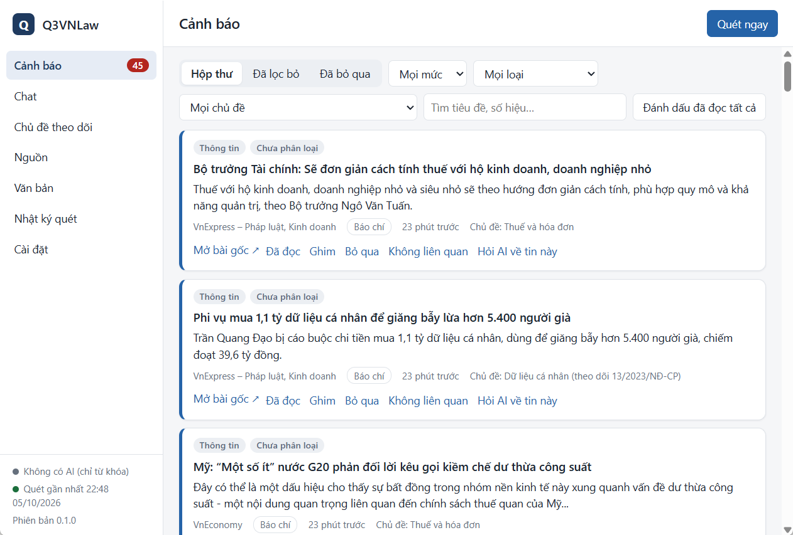

> **Đổi tên:** ứng dụng trước đây tên **Q3VNLaw**. Bản cũ nâng lên bản này vẫn giữ nguyên chủ
> đề, cảnh báo, văn bản và cài đặt (xem [mục 9](#9-dữ-liệu-và-quyền-riêng-tư)). Tên kho mã
> nguồn trên GitHub vẫn là `VLSIT_Q3VNLaw_Chat_Bot`.

> Q3VigilAI là công cụ theo dõi và tra cứu, không phải dịch vụ tư vấn pháp lý. Tóm tắt và
> phân loại có thể sai; tình trạng hiệu lực của văn bản là suy luận. Luôn đối chiếu với
> văn bản gốc trước khi áp dụng.

**Mục lục**

1. [Bắt đầu nhanh](#1-bắt-đầu-nhanh)
2. [Biểu tượng ở khay hệ thống](#2-biểu-tượng-ở-khay-hệ-thống)
3. [Thông báo](#3-thông-báo)
4. [Hướng dẫn từng màn hình](#4-hướng-dẫn-từng-màn-hình)
5. [Các việc thường làm](#5-các-việc-thường-làm)
6. [Đọc hiểu một cảnh báo](#6-đọc-hiểu-một-cảnh-báo)
7. [Cài đặt AI](#7-cài-đặt-ai)
8. [Xử lý sự cố](#8-xử-lý-sự-cố)
9. [Dữ liệu và quyền riêng tư](#9-dữ-liệu-và-quyền-riêng-tư)
10. [Chạy ngầm nhẹ](#10-chạy-ngầm-nhẹ)
11. [Build từ mã nguồn](#11-build-từ-mã-nguồn)
12. [Giới hạn cần biết](#12-giới-hạn-cần-biết)

> Các ảnh chụp trong tài liệu này lấy từ một bản chạy thật ở **chế độ không AI**, nên thẻ
> cảnh báo có nhãn "Chưa phân loại" và Chat hiện kết quả tìm kiếm. Khi có AI, thẻ có thêm
> tóm tắt, đối tượng chịu tác động và trích dẫn nguyên văn (xem mục 6).

---

## 1. Bắt đầu nhanh

1. **Chạy chương trình.** Chép `q3vigilai.exe` vào một thư mục bất kỳ rồi bấm đúp. Lần đầu,
   Windows SmartScreen có thể hỏi vì file chưa ký số: chọn **More info → Run anyway**.
2. **Tìm biểu tượng.** Chữ **Q** màu xanh xuất hiện ở khay hệ thống (góc phải thanh tác
   vụ). Windows 11 thường xếp biểu tượng mới vào ngăn ẩn: bấm mũi tên **^** cạnh đồng hồ,
   rồi kéo biểu tượng ra thanh tác vụ nếu muốn thấy thường xuyên.
3. **Mở cửa sổ.** Bấm vào biểu tượng. Cửa sổ ứng dụng mở bằng Microsoft Edge (không có
   thanh địa chỉ); máy không có Edge thì mở bằng trình duyệt mặc định.
4. **Tạo chủ đề.** Vào **Chủ đề theo dõi → + Thêm chủ đề**, chọn một lĩnh vực (ví dụ
   *Thuế*) hoặc gõ từ khóa, rồi **Lưu**. Ứng dụng áp dụng ngay chủ đề lên các tin đã thu
   thập; cảnh báo xuất hiện ở màn hình **Cảnh báo** sau vài giây đến khoảng một phút (lâu hơn
   nếu bật AI, vì mỗi tin khớp cần một lần gọi AI).
5. **(Tùy chọn) Bật AI** ở **Cài đặt → AI** (xem [mục 7](#7-cài-đặt-ai)).
6. **(Tùy chọn) Đổi ngôn ngữ.** Giao diện mặc định là tiếng Việt. Chọn **English** ở ô
   **Ngôn ngữ** dưới thanh bên (hoặc ở Cài đặt) là toàn bộ cửa sổ, menu khay và thông báo
   chuyển sang tiếng Anh ngay, không cần khởi động lại.

Từ đó ứng dụng tự quét theo lịch (mặc định 07:00–21:00): báo chí mỗi 1 giờ, cổng văn bản
của Chính phủ mỗi 3 giờ. Bạn có thể đóng cửa sổ; ứng dụng vẫn chạy ngầm ở khay cho tới khi
chọn **Thoát**. Bấm **Quét ngay** (góc trên phải) để quét lập tức, bất kể giờ nào.

Chạy file lần thứ hai không mở thêm bản mới, chỉ mở lại cửa sổ của bản đang chạy.

Dữ liệu nằm trong thư mục `data\` cạnh file chạy. Xóa cả thư mục là gỡ xong.

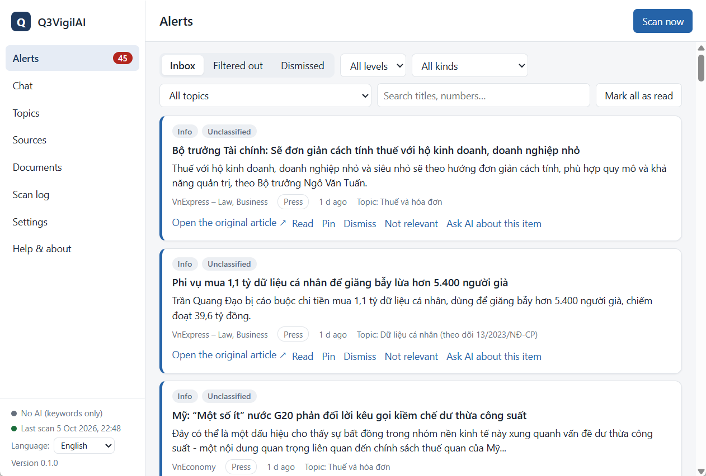

*Cùng màn hình Cảnh báo sau khi chọn English.*

---

## 2. Biểu tượng ở khay hệ thống

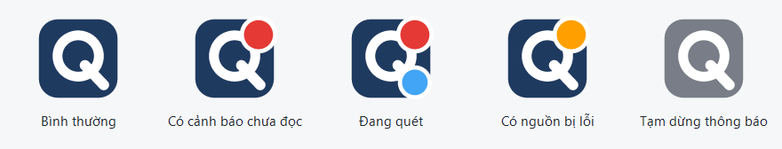

| Trên biểu tượng | Nghĩa |
|---|---|
| Không có chấm | Bình thường, không có cảnh báo chưa đọc |
| Chấm đỏ góc trên | Có cảnh báo chưa đọc |
| Chấm xanh góc dưới | Đang quét |
| Chấm vàng góc trên | Có nguồn không quét được (và không có cảnh báo chưa đọc) |
| Nền xám | Đang tạm dừng thông báo |

Rê chuột lên biểu tượng để xem trạng thái, ví dụ *"Q3VigilAI — 3 cảnh báo chưa đọc"*.

**Bấm trái** vào biểu tượng: mở cửa sổ tại màn hình Cảnh báo.

**Bấm phải**: mở menu.

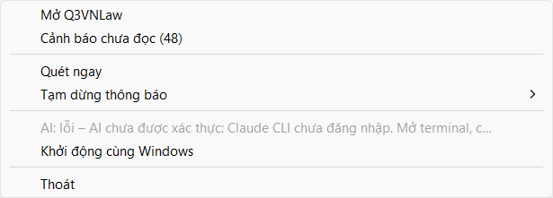

| Mục | Làm gì |
|---|---|
| Mở Q3VigilAI | Mở cửa sổ |
| Cảnh báo chưa đọc (N) | Mở màn hình Cảnh báo |
| Quét ngay | Quét tất cả nguồn đang bật |
| Tạm dừng thông báo ▸ | 1 giờ, hoặc đến 7 giờ sáng mai; có thêm "Bật lại ngay" khi đang tạm dừng |
| AI: … | Chỉ để xem: AI đang dùng, hoặc lý do AI không dùng được |
| Khởi động cùng Windows | Bật/tắt (có dấu tick khi đang bật) |
| Thoát | Dừng ứng dụng, gỡ biểu tượng |

Menu dùng ngôn ngữ đã chọn; bản English:

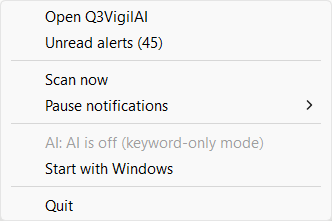

---

## 3. Thông báo

Khi có cảnh báo đủ quan trọng, Windows hiện thông báo nổi ở góc màn hình. **Bấm vào thông
báo** để mở thẳng cảnh báo đó.

### Ba mức cảnh báo

| Mức | Khi nào | Thông báo nổi mặc định |
|---|---|---|
| **Cảnh báo** | Văn bản bạn theo dõi đích danh bị sửa đổi, thay thế, hướng dẫn | Bật |
| **Cần chú ý** | Văn bản chính thức mới khớp chủ đề; tin báo chí khớp chủ đề đã ban hành hoặc có hiệu lực; văn bản sắp có hiệu lực | Bật |
| **Thông tin** | Các tin báo chí khớp từ khóa còn lại, dự thảo, đề xuất | **Tắt** |

Cảnh báo mức Thông tin vẫn nằm trong danh sách và vẫn làm biểu tượng khay có chấm đỏ; chỉ
là không bật thông báo nổi. Muốn nhận cả loại này, tick **Mức Thông tin** ở Cài đặt →
Thông báo (có thể rất nhiều thông báo khi chưa dùng AI).

### Quy tắc khác

- **Giờ yên lặng** (mặc định 21:00–07:00): cảnh báo vẫn được ghi, thông báo dồn sang lúc hết
  giờ yên lặng. Đặt hai giờ bằng nhau để tắt giờ yên lặng.
- **Tạm dừng** từ menu khay có tác dụng tương tự.
- **Gộp thông báo**: nhiều hơn 3 cảnh báo cùng lúc thì gộp thành một thông báo tóm tắt.
- **Thông báo hệ thống**: nếu một nguồn lỗi hoặc không còn trả tin từ 3 lần quét liên tiếp,
  ứng dụng báo **một lần mỗi ngày**. Im lặng ở đây sẽ bị hiểu nhầm là "không có tin mới".
- **Bấm "Quét ngay"** luôn được trả lời bằng một thông báo tóm tắt (kể cả "không có tin mới
  khớp"), và hiện cả trong giờ yên lặng.
- **Gửi thông báo thử**: Cài đặt → Thông báo → nút **Gửi thông báo thử** để kiểm tra thông
  báo có tới màn hình không.

> Windows có chế độ **Không làm phiền**. Khi biểu tượng chuông ở góc dưới phải có chữ
> **zZ**, Windows chặn mọi thông báo nổi và chỉ cất vào Trung tâm thông báo (Win + N). Lúc
> đó Q3VigilAI vẫn gửi thông báo, nhưng bạn không thấy nó.

---

## 4. Hướng dẫn từng màn hình

Cửa sổ gồm thanh bên trái (chọn màn hình) và vùng nội dung. Nút **Quét ngay** luôn ở góc
trên phải. Dưới cùng thanh bên có các dòng trạng thái:

- **AI**: đang dùng AI nào, hoặc *"Không có AI (chỉ từ khóa)"*, hoặc *"AI lỗi: …"* kèm lý do.
- **Quét gần nhất**: thời điểm lượt quét trước.
- **Nguồn lỗi / Thông báo đang tạm im**: chỉ hiện khi có.
- **Ngôn ngữ**: ô chọn Tiếng Việt / English.
- **Phiên bản**.

Con số đỏ cạnh **Cảnh báo** là số cảnh báo chưa đọc.

### 4.1 Cảnh báo

Màn hình chính: mọi tin khớp chủ đề của bạn, mới nhất ở trên, cảnh báo đã ghim lên đầu.

**Bộ lọc** (hàng trên cùng)

| Điều khiển | Dùng để |
|---|---|
| **Hộp thư / Đã lọc bỏ / Đã bỏ qua** | Chuyển danh sách. *Hộp thư* là cảnh báo đang theo dõi. *Đã lọc bỏ* là tin khớp từ khóa nhưng bị loại (AI đánh giá không liên quan, hoặc là dự thảo trong khi chủ đề không theo dõi dự thảo). Nên xem qua tab này để chắc không lọc sót. *Đã bỏ qua* là những gì bạn đã bấm "Bỏ qua" |
| **Mọi mức** | Lọc theo Cảnh báo, Cần chú ý, Thông tin |
| **Mọi loại** | Báo chí, Văn bản chính thức, Văn bản theo dõi, Sắp có hiệu lực |
| **Mọi chủ đề** | Chỉ xem một chủ đề |
| Ô tìm kiếm | Tìm trong tiêu đề, tóm tắt và số hiệu |
| **Đánh dấu đã đọc tất cả** | Xóa số đỏ chưa đọc |

**Một thẻ cảnh báo**

- Hàng nhãn: mức, loại (nếu không phải báo chí), **trạng thái pháp lý** (Đề xuất / Dự thảo /
  Đã ban hành / Đã có hiệu lực / Tin liên quan / Chưa phân loại), **Đã xác nhận** (xanh) hoặc
  **Chưa xác nhận** (vàng), **Đã ghim**.
- Tiêu đề (bấm để mở chi tiết) và tóm tắt.
- Dòng thông tin: nguồn (và "và N nguồn khác" nếu nhiều báo cùng đưa), tầng nguồn, thời
  điểm, chủ đề, ngày hiệu lực, số hiệu văn bản được nhắc tới.
- Hàng thao tác:

| Thao tác | Tác dụng |
|---|---|
| **Mở bài gốc ↗** / **Mở trên cổng chính thức ↗** | Mở nguồn trong trình duyệt |
| **Đã đọc / Chưa đọc** | Đổi trạng thái đọc. Mở chi tiết một thẻ cũng tự đánh dấu đã đọc |
| **Ghim / Bỏ ghim** | Giữ thẻ ở đầu danh sách |
| **Bỏ qua** | Chuyển sang tab *Đã bỏ qua* |
| **Không liên quan** | Bỏ qua và ghi nhận phản hồi là không liên quan |
| **Hỏi AI về tin này** | Mở Chat, giới hạn trong các nguồn của cảnh báo này |

**Chi tiết** (bấm tiêu đề):

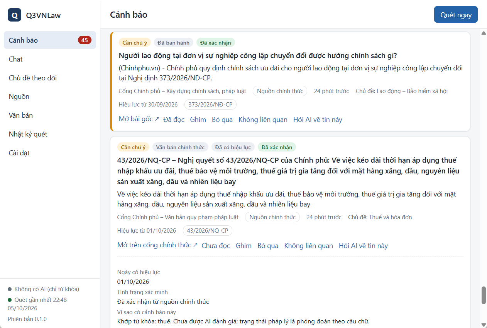

Phần chi tiết cho biết ngày có hiệu lực, tình trạng xác minh, **vì sao có cảnh báo này**
(từ khóa nào khớp), ai đánh giá (AI nào, hay "quy tắc từ khóa, không có AI"), và liên kết
tới văn bản chính thức trong thư viện cùng mọi nguồn đã đưa tin. Có AI thì thêm *Ảnh hưởng
tới* và *Trích nguyên văn làm căn cứ*.

### 4.2 Chat

Hỏi đáp trên các văn bản và bài báo mà ứng dụng **đã thu thập**; nó không tìm trên mạng.

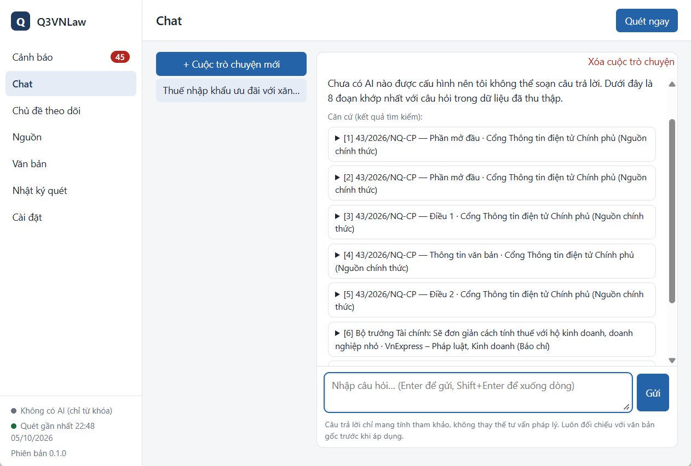

- **+ Cuộc trò chuyện mới** tạo phiên mới; cột trái liệt kê các phiên cũ.
- Gõ câu hỏi, **Enter** để gửi (Shift + Enter xuống dòng).
- Mỗi câu trả lời kèm khối **Căn cứ**: các đoạn trích đã dùng, ghi rõ văn bản hoặc bài báo,
  Điều/Khoản, nguồn và tầng nguồn. Bấm vào từng đoạn để đọc nguyên văn và mở nguồn. Đoạn
  mờ là đoạn tìm thấy nhưng không được dùng trong câu trả lời.
- **Phạm vi**: phiên tạo từ nút *Hỏi AI về tin này* chỉ dùng nguồn của cảnh báo đó; phiên
  tạo từ *Hỏi AI về văn bản này* chỉ dùng văn bản đó; phiên tạo từ Chat dùng toàn bộ kho.
- **Không có căn cứ thì không trả lời**: nếu không tìm thấy đoạn nào khớp, ứng dụng nói rõ
  là dữ liệu chưa có căn cứ, và **không gọi AI**.
- **Không có AI** (hoặc AI lỗi): Chat hiện danh sách đoạn khớp nhất, như một ô tìm kiếm.
- Dưới ô nhập luôn có dòng nhắc: câu trả lời chỉ mang tính tham khảo.

### 4.3 Chủ đề theo dõi

Mỗi chủ đề là một bộ điều kiện; tin nào khớp sẽ thành cảnh báo.

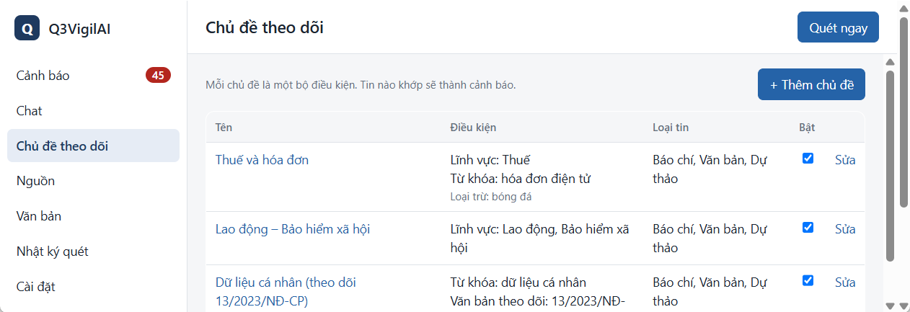

Cột **Bật** để tạm tắt một chủ đề mà không xóa; **Sửa** mở biểu mẫu. Biểu mẫu:

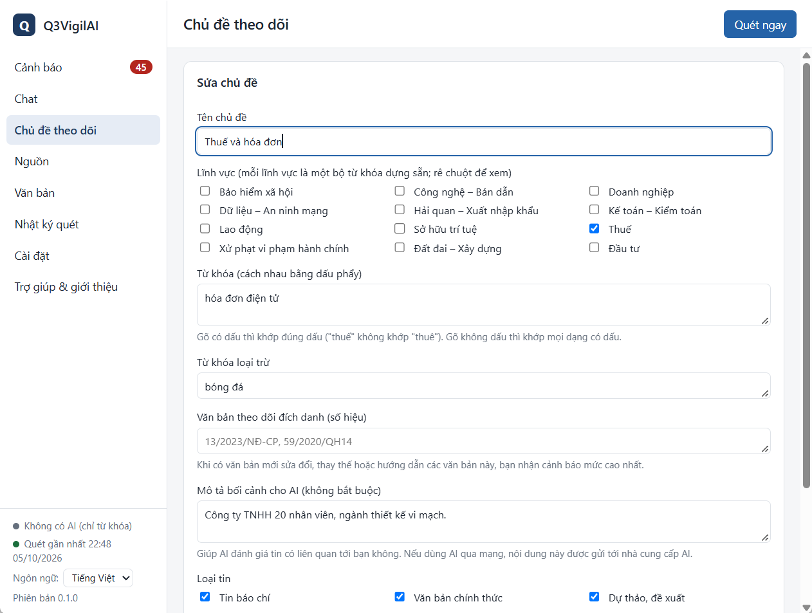

| Trường | Ý nghĩa |
|---|---|
| **Tên chủ đề** | Bắt buộc |
| **Lĩnh vực** | Mỗi lĩnh vực là một bộ từ khóa dựng sẵn (rê chuột để xem danh sách). Có 12 lĩnh vực: Bảo hiểm xã hội, Công nghệ – Bán dẫn, Doanh nghiệp, Dữ liệu – An ninh mạng, Hải quan – Xuất nhập khẩu, Kế toán – Kiểm toán, Lao động, Sở hữu trí tuệ, Thuế, Xử phạt vi phạm hành chính, Đất đai – Xây dựng, Đầu tư |
| **Từ khóa** | Cách nhau bằng dấu phẩy; cụm nhiều chữ được tính là một cụm. Khớp theo từ nguyên vẹn. **Gõ có dấu thì khớp đúng dấu** ("thuế" không khớp "thuê"); **gõ không dấu thì khớp mọi dạng có dấu** |
| **Từ khóa loại trừ** | Tin chứa từ này bị bỏ qua |
| **Văn bản theo dõi đích danh** | Số hiệu, ví dụ `13/2023/NĐ-CP`. Khi có văn bản mới sửa đổi, thay thế hoặc hướng dẫn văn bản này, bạn nhận cảnh báo mức cao nhất |
| **Mô tả bối cảnh cho AI** | Không bắt buộc. Giúp AI đánh giá tin có liên quan tới bạn không. Nếu dùng AI qua mạng, đoạn này được gửi tới nhà cung cấp AI |
| **Loại tin** | Tin báo chí / Văn bản chính thức / Dự thảo, đề xuất |
| **Nhắc trước ngày có hiệu lực** | Số ngày; 0 là không nhắc |
| **Bật chủ đề này** | |

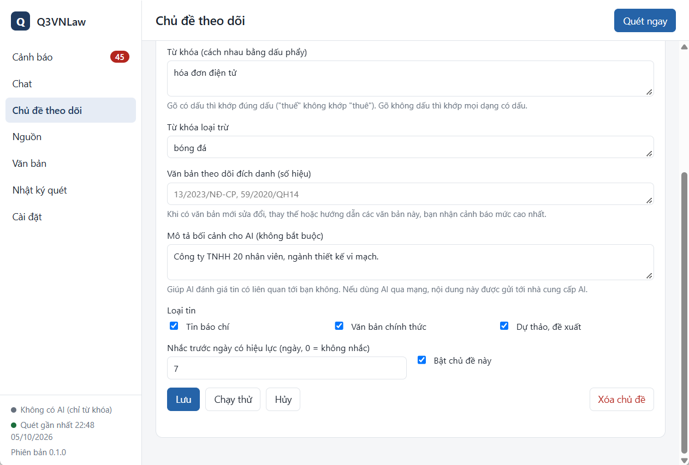

- **Chạy thử** cho biết với các tin đã thu thập trong 30 ngày qua, có bao nhiêu tin khớp
  điều kiện hiện tại và liệt kê vài tin mẫu, **trước khi lưu**. Dùng nút này để chỉnh từ khóa.
- **Lưu** xong, chủ đề được áp dụng ngay lên các tin đã thu thập trong cửa sổ nhìn lại
  (mặc định 7 ngày); việc này hiện ở Nhật ký quét với kiểu "Áp dụng chủ đề".
- **Xóa chủ đề** xóa luôn mọi cảnh báo của chủ đề đó.

Chủ đề cần ít nhất một từ khóa, một lĩnh vực hoặc một văn bản theo dõi.

### 4.4 Nguồn

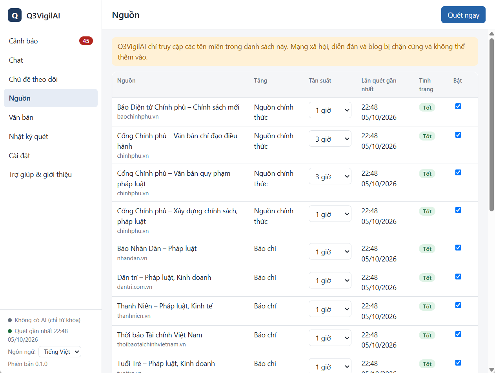

Ứng dụng **chỉ truy cập các tên miền trong danh sách này**. Mạng xã hội, diễn đàn và blog bị
chặn cứng trong mã nguồn và không thể thêm vào.

| Cột | Ý nghĩa |
|---|---|
| **Tầng** | *Nguồn chính thức*: Cổng Thông tin điện tử Chính phủ và Báo Chính phủ. *Báo chí*: báo có giấy phép |
| **Tần suất** | Chọn từ 30 phút đến 1 ngày |
| **Tình trạng** | *Tốt*; *Không có tin*; *Lỗi lần gần nhất*; *Lỗi N lần liên tiếp*; *Nghi hỏng: không còn trả tin* (trang có thể đã đổi cấu trúc); *Chưa quét*; *Đang tắt*. Rê chuột lên nhãn để xem lỗi cụ thể |
| **Bật** | Tạm tắt một nguồn |

Nguồn dựng sẵn chỉ có thể tắt, không xóa được. 15 nguồn dựng sẵn gồm: văn bản quy phạm
pháp luật và văn bản chỉ đạo điều hành của Cổng Chính phủ, chuyên trang xây dựng chính
sách, Báo Chính phủ, Nhân Dân, VietnamPlus (TTXVN), VOV, VTV, VnExpress, Tuổi Trẻ, Thanh
Niên, Dân trí, VietNamNet, VnEconomy, Thời báo Tài chính.

**Thêm nguồn báo chí**

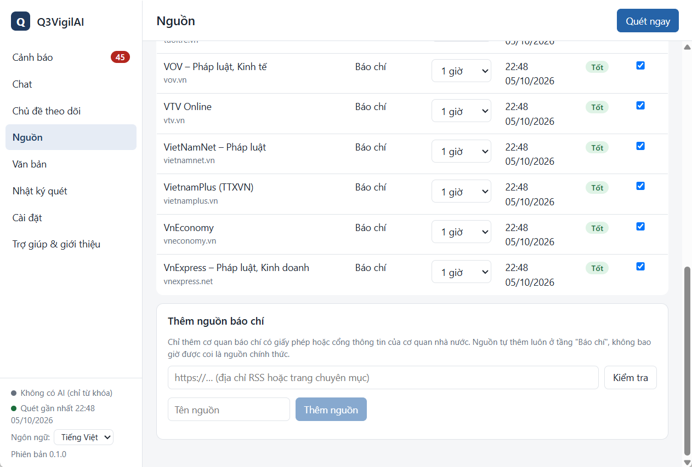

1. Dán địa chỉ **RSS** hoặc trang chuyên mục (phải là `https`) rồi bấm **Kiểm tra**. Ứng dụng
   đọc thử và hiện vài tin đầu để bạn xác nhận.
2. Đặt tên rồi bấm **Thêm nguồn**.

Nguồn tự thêm luôn ở tầng *Báo chí*, không bao giờ được coi là nguồn chính thức.

### 4.5 Văn bản

Thư viện các **văn bản chính thức** đã tải từ Cổng Chính phủ. Văn bản vào thư viện khi một
cảnh báo được xác nhận, hoặc khi bạn tải theo số hiệu.

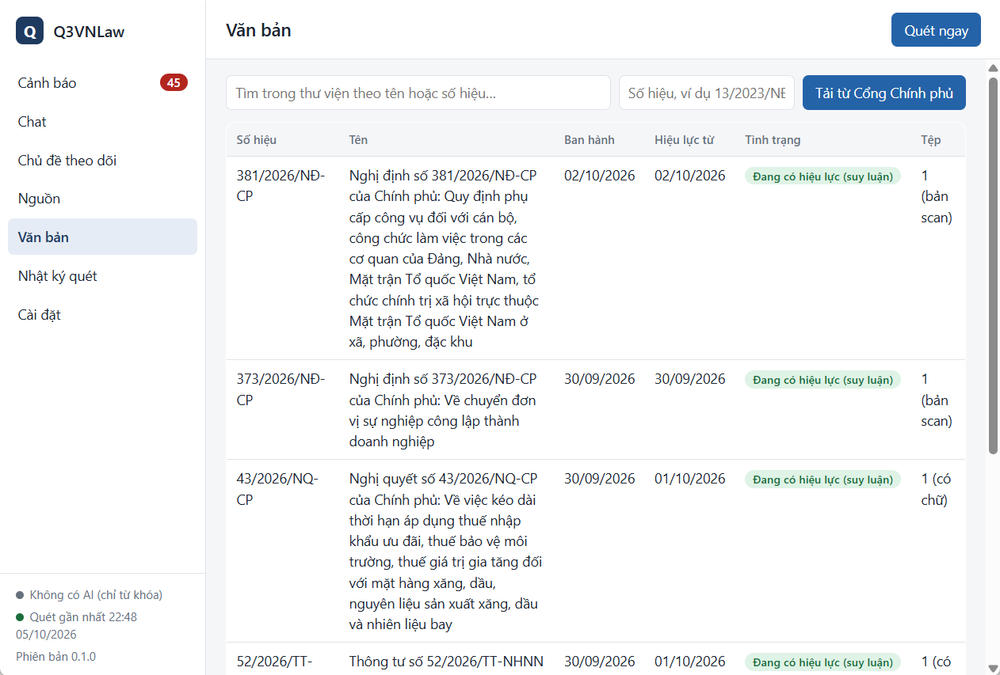

- Ô trái: tìm trong thư viện theo tên hoặc số hiệu.
- Ô phải: nhập số hiệu (ví dụ `59/2020/QH14`, gõ không dấu cũng được) rồi **Tải từ Cổng
  Chính phủ**. Cổng có văn bản thì ứng dụng tải về cả file gốc.
- Cột **Tình trạng** luôn kèm chữ **(suy luận)**: Cổng chỉ ghi ngày ban hành và ngày có hiệu
  lực, không ghi văn bản còn hay hết hiệu lực. Hãy đối chiếu tại vbpl.vn trước khi trích dẫn.
- Cột **Tệp**: *(có chữ)* là PDF có lớp chữ, tìm kiếm và hỏi đáp được; *(bản scan)* là ảnh
  chụp, chưa tìm kiếm được.
- Trước khi tải, ứng dụng ước tính tổng dung lượng các tệp đính kèm. Nếu tổng vượt 50 MB
  hoặc máy chủ không công bố đủ dung lượng để ước tính, ứng dụng hỏi xác nhận trước. Các
  lượt tải nền bỏ qua bộ tệp cần xác nhận; nhập số hiệu tại đây để chủ động tải.

Bấm một dòng để xem chi tiết:

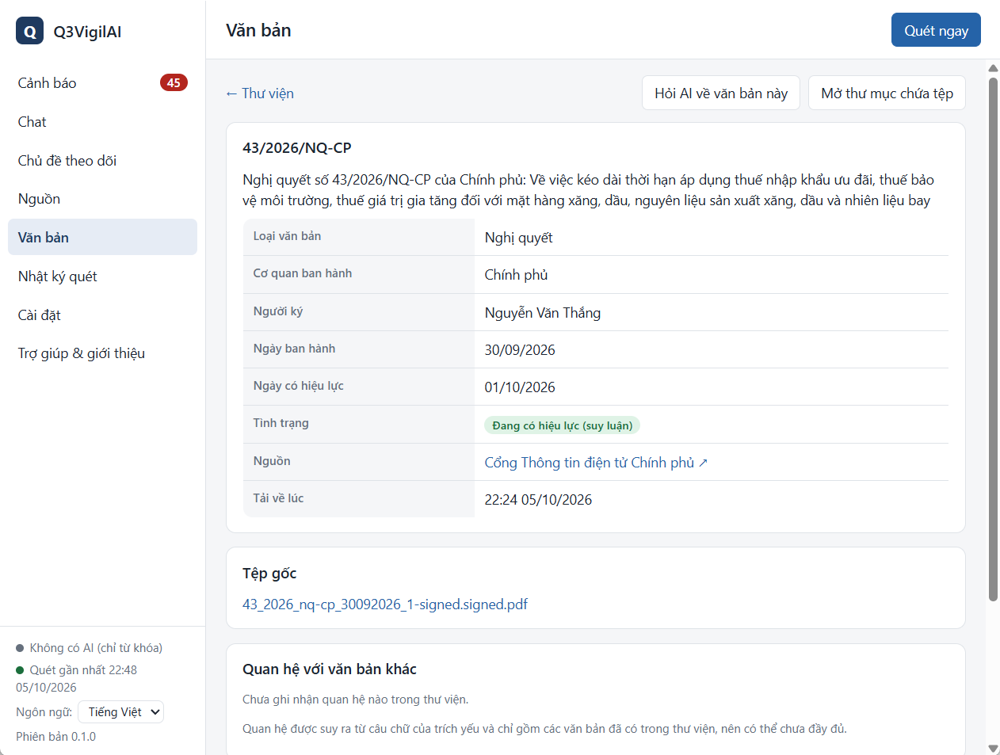

- **Hỏi AI về văn bản này**: mở Chat giới hạn trong văn bản đó.
- **Mở thư mục chứa tệp**: mở thư mục trong Explorer. Danh sách tệp hiển thị đường dẫn tương
  đối trong thư mục dữ liệu; bấm đường dẫn để mở trực tiếp PDF đã tải trong trình duyệt.
- **Quan hệ với văn bản khác**: văn bản nào sửa đổi, thay thế, hướng dẫn văn bản này, suy ra
  từ câu chữ trích yếu và chỉ gồm các văn bản đã có trong thư viện, nên có thể chưa đầy đủ.

### 4.6 Nhật ký quét

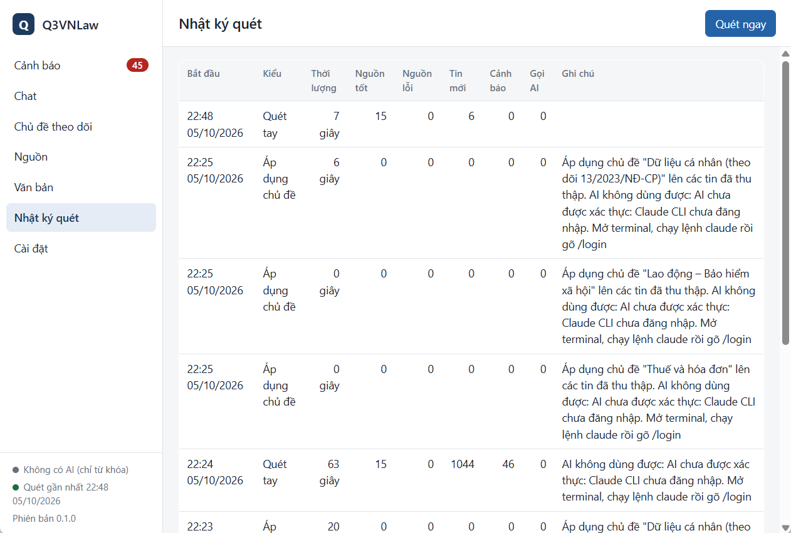

Mỗi dòng là một lượt quét: kiểu (*Theo lịch*, *Quét tay*, *Quét bù*, *Áp dụng chủ đề*),
thời lượng, số nguồn tốt và lỗi, tin mới, cảnh báo, số lần gọi AI, và ghi chú (lỗi theo từng
nguồn, hoặc lý do AI không dùng được). Đây là nơi trả lời câu hỏi "ứng dụng có đang quét
không, và quét ra gì".

*Quét bù* là một lượt quét gộp sau khi máy ngủ hoặc tắt lâu: các lượt bị lỡ không chạy
dồn mà gộp thành một.

### 4.7 Cài đặt

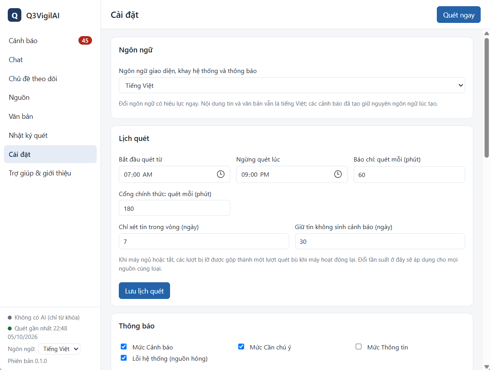

**Ngôn ngữ**: Tiếng Việt hoặc English, áp dụng cho cửa sổ, menu khay và thông báo; có hiệu lực
ngay. Tên văn bản, bài báo và từ khóa vẫn là tiếng Việt vì đó là nội dung gốc. Các cảnh báo
đã tạo giữ nguyên ngôn ngữ lúc tạo; từ khóa của chủ đề phải viết bằng tiếng Việt vì tin cần
khớp là tin tiếng Việt. Khi chọn English, câu trả lời của AI trong Chat cũng được yêu cầu viết
bằng tiếng Anh (trích dẫn vẫn nguyên văn tiếng Việt).

**Lịch quét**: khung giờ quét tự động; tần suất cho báo chí và cổng chính thức (áp dụng cho
mọi nguồn cùng loại); chỉ xét tin trong vòng bao nhiêu ngày; giữ tin không sinh cảnh báo
bao lâu. Bấm **Quét ngay** thì bỏ qua khung giờ.

**Thông báo**: mức nào hiện thông báo nổi, giờ yên lặng, ngưỡng gộp thông báo, nút **Gửi
thông báo thử**.

**AI**: chọn loại AI, đường dẫn, model, địa chỉ máy chủ, khóa API, số lần gọi tối đa mỗi
lượt quét, thời gian chờ; nút **Lưu cài đặt AI** và **Kiểm tra kết nối**. Xem mục 7.

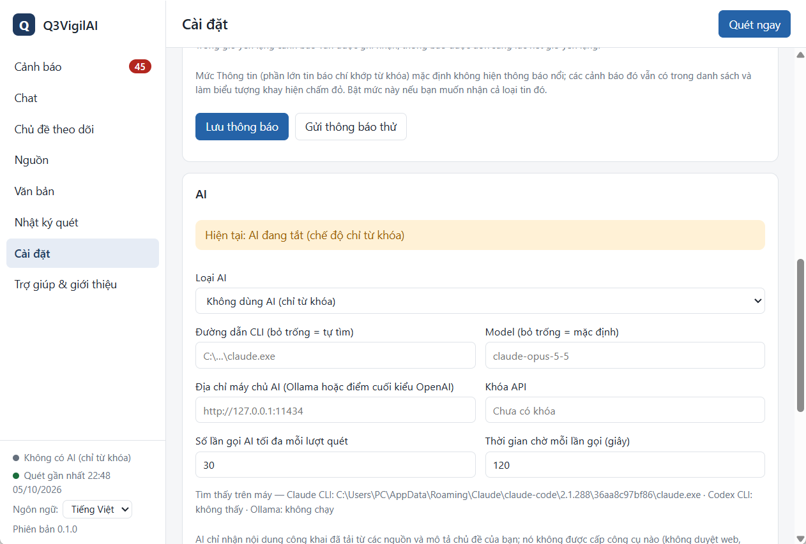

**Hệ thống**: **Khởi động cùng Windows**, thư mục dữ liệu, **Sao lưu cơ sở dữ liệu ngay**.

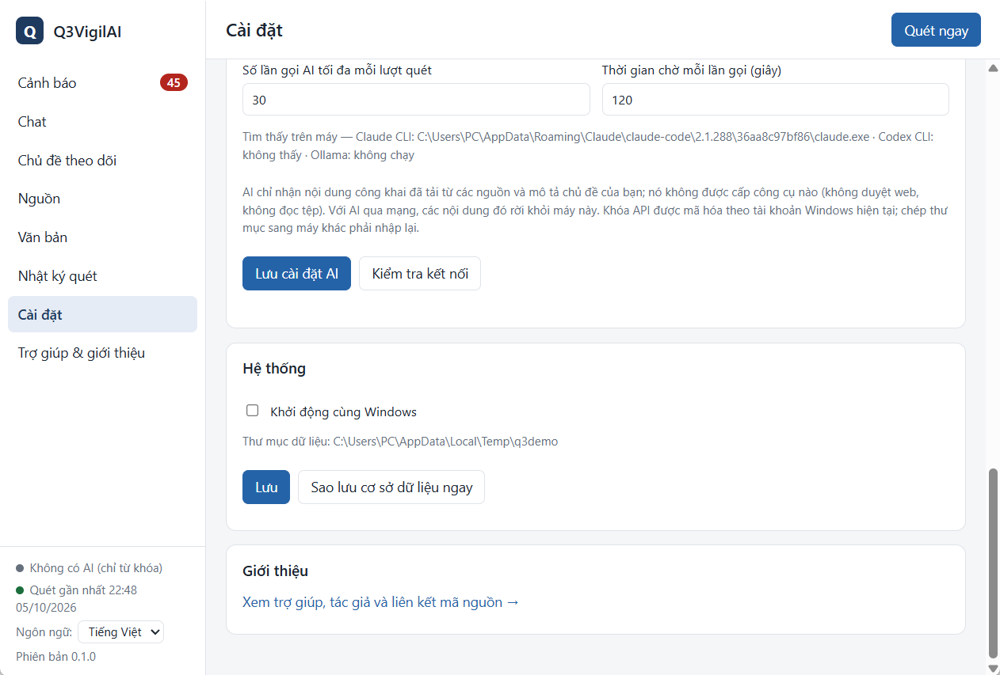

### 4.8 Trợ giúp & giới thiệu

Mục cuối thanh bên (và liên kết **Giới thiệu** ở cuối trang Cài đặt).

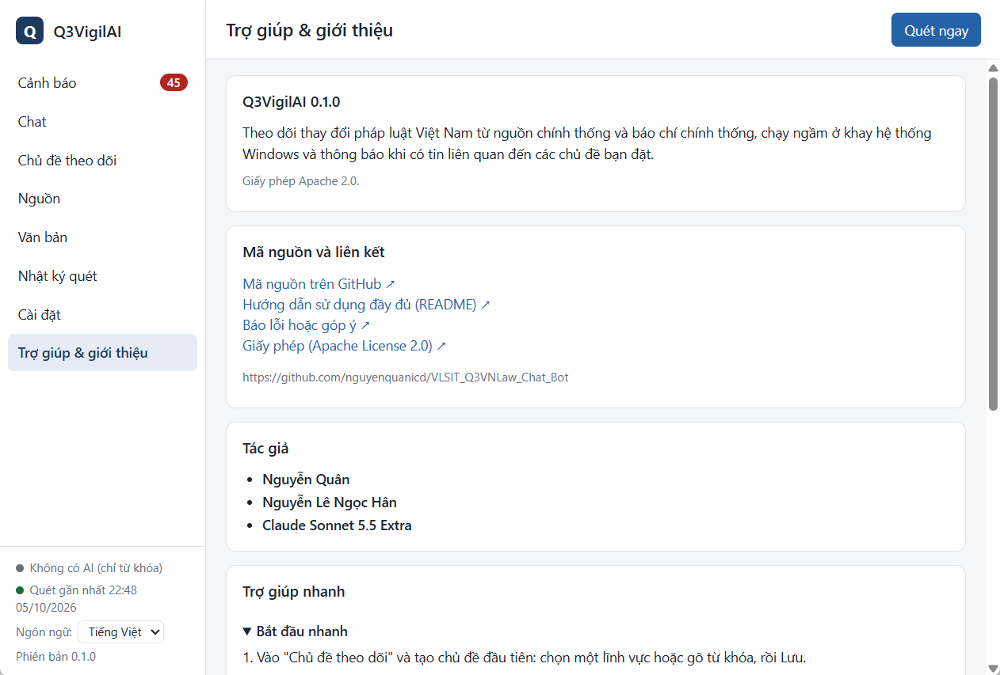

- **Mã nguồn và liên kết**: kho mã nguồn trên GitHub
  ([nguyenquanicd/VLSIT_Q3VNLaw_Chat_Bot](https://github.com/nguyenquanicd/VLSIT_Q3VNLaw_Chat_Bot)),
  hướng dẫn sử dụng đầy đủ (README này), nơi báo lỗi hoặc góp ý, và giấy phép Apache 2.0.
- **Tác giả**: Nguyễn Quân, Nguyễn Lê Ngọc Hân, Claude Sonnet 5.5 Extra.
- **Trợ giúp nhanh**: các mục thu gọn về bắt đầu nhanh, thông báo không hiện, cách đọc một
  cảnh báo, bật AI, vị trí dữ liệu, kèm lời nhắc đây không phải tư vấn pháp lý. Thư mục dữ
  liệu đang dùng cũng được ghi ở cuối trang.

---

## 5. Các việc thường làm

### Theo dõi một lĩnh vực pháp luật
Chủ đề theo dõi → **+ Thêm chủ đề** → tick lĩnh vực (ví dụ *Lao động* và *Bảo hiểm xã hội*)
→ **Chạy thử** để xem có bao nhiêu tin khớp → **Lưu**. Thêm từ khóa riêng của ngành nếu
muốn thu hẹp, và từ khóa loại trừ để bớt tin nhiễu.

### Được báo khi một văn bản cụ thể bị sửa đổi
Tạo chủ đề, điền số hiệu vào **Văn bản theo dõi đích danh** (ví dụ `13/2023/NĐ-CP`). Ứng dụng
lưu văn bản đó vào thư viện và mỗi ngày tìm trên Cổng Chính phủ các văn bản mới nhắc tới nó.
Lần kiểm tra đầu chỉ ghi nhận những gì đã có; từ lần sau, văn bản mới sửa đổi, thay thế hoặc
hướng dẫn nó sẽ thành cảnh báo mức **Cảnh báo**.

### Tải một văn bản theo số hiệu
Văn bản → nhập số hiệu → **Tải từ Cổng Chính phủ**. Không thấy thì Cổng chưa đăng hoặc không
lưu loại văn bản đó (văn bản địa phương, văn bản rất cũ); hãy tra tại vbpl.vn hoặc
congbao.chinhphu.vn.

### Biết trước ngày một văn bản có hiệu lực
Đặt **Nhắc trước ngày có hiệu lực** trong chủ đề (mặc định 7 ngày). Khi một văn bản trong
thư viện, đã gắn với cảnh báo của chủ đề, sắp có hiệu lực, bạn nhận một cảnh báo "Sắp có hiệu
lực từ …".

### Hỏi về một tin hoặc một văn bản
Ở thẻ cảnh báo bấm **Hỏi AI về tin này**, hoặc ở trang văn bản bấm **Hỏi AI về văn bản
này**. Câu trả lời chỉ dựa trên chính các nguồn đó, kèm đoạn trích.

### Thêm một tờ báo
Nguồn → kéo xuống **Thêm nguồn báo chí** → dán địa chỉ RSS → **Kiểm tra** → **Thêm nguồn**.

### Chỉ muốn nhận thông báo khi thật quan trọng
Giữ mặc định (chỉ Cảnh báo và Cần chú ý), hoặc tắt luôn mức Cần chú ý ở Cài đặt → Thông báo
nếu chỉ cần mức Cảnh báo. Mọi cảnh báo vẫn có trong danh sách.

### Tạm im lặng
Menu khay → **Tạm dừng thông báo** → 1 giờ hoặc đến sáng mai.

---

## 6. Đọc hiểu một cảnh báo

### Loại tin: báo chí và văn bản chính thức

| Loại | Nguồn | Dùng để |
|---|---|---|
| **Tin báo chí** | Báo chí chính thống | Biết sớm. **Chưa dùng làm căn cứ** |
| **Văn bản chính thức** | Cổng Thông tin điện tử Chính phủ | Có số hiệu, file gốc, ngày hiệu lực; dùng làm căn cứ |

### Nhãn xác minh

| Nhãn | Nghĩa |
|---|---|
| **Đã xác nhận** | Văn bản được nhắc tới đã được tìm thấy trên Cổng Chính phủ. Cảnh báo có link tới văn bản và file gốc |
| **Chưa xác nhận** | Tin báo chí nhắc một văn bản mới nhưng chưa thấy trên Cổng. Ứng dụng tra lại **mỗi ngày trong 30 ngày**; khi xuất hiện, cảnh báo được nâng thành "Đã xác nhận" và bạn được báo |
| (không nhãn) | Tin không nhắc văn bản mới nào để xác minh |

Báo chí thường đưa tin trước khi văn bản lên Cổng, nên "chưa xác nhận" là bình thường với
tin rất mới.

### Trạng thái pháp lý

Báo chí hay viết "đề xuất tăng…" hoặc "dự kiến từ…", rất dễ bị hiểu nhầm là quy định đã có
hiệu lực. Vì vậy mỗi cảnh báo mang một trạng thái:

| Trạng thái | Nghĩa |
|---|---|
| Đề xuất | Đề xuất, kiến nghị, đang nghiên cứu |
| Dự thảo | Dự thảo đang lấy ý kiến hoặc đang trình |
| Đã ban hành | Đã ban hành, chưa tới ngày hiệu lực |
| Đã có hiệu lực | Đã có hiệu lực |
| Tin liên quan | Tin giải thích, hướng dẫn, xử lý vi phạm… |
| Chưa phân loại | Không xác định được |

Có AI thì AI phân loại. **Không có AI** thì đoán theo câu chữ ("dự thảo", "đề xuất", "có hiệu
lực từ", "ban hành"…) và phần chi tiết ghi rõ đó là phỏng đoán. Với văn bản chính thức, trạng
thái lấy từ ngày ban hành và ngày hiệu lực của Cổng.

### Khi có AI

AI đọc từng tin và trả về: có liên quan chủ đề không, mức liên quan, trạng thái pháp lý,
tóm tắt 2–3 câu, đối tượng chịu tác động, ngày hiệu lực, và một câu **trích nguyên văn** làm
căn cứ. Ứng dụng kiểm lại: câu trích phải thật sự có trong bài và số hiệu văn bản phải thật
sự xuất hiện trong tin, nếu không thì bỏ phần đó. Tin AI đánh giá là không liên quan nằm ở
tab *Đã lọc bỏ*, không bị xóa.

---

## 7. Cài đặt AI

Vào **Cài đặt → AI**, chọn loại AI, bấm **Lưu cài đặt AI**, rồi **Kiểm tra kết nối**. Nút
kiểm tra gọi thử một lần thật và báo ngay nếu AI không dùng được (chưa đăng nhập, sai khóa,
không có model…).

Mặc định là **Tự dò**, theo thứ tự Claude CLI → Codex CLI → Ollama. Ứng dụng tìm Claude CLI
trong PATH, các thư mục cài đặt quen thuộc, và bản đi kèm ứng dụng Claude desktop.

| Loại | Cần gì |
|---|---|
| **Claude CLI** | Đã cài và **đã đăng nhập**: mở terminal, chạy `claude`, gõ `/login` |
| **Codex CLI** | Đã cài và đã đăng nhập |
| **Ollama** | Ollama đang chạy và đã tải ít nhất một model (`ollama pull …`) |
| **Anthropic API** | Khóa API. Model mặc định `claude-opus-5-5`; có thể nhập model khác (ví dụ `claude-sonnet-5-5`) vào ô Model |
| **Điểm cuối kiểu OpenAI** | Địa chỉ máy chủ, tên model, khóa API nếu có. Dùng cho dịch vụ khác hoặc máy chủ model chạy trên máy |
| **Không dùng AI** | Chỉ khớp từ khóa |

Lưu ý:

- **AI không được cấp công cụ nào**: không duyệt web, không đọc file, không chạy lệnh. Nó chỉ
  nhận văn bản mà ứng dụng đưa vào và trả lại văn bản.
- **Mỗi cảnh báo cần một lần gọi AI**, tính vào hạn mức hoặc tiền của tài khoản bạn. Mặc định
  tối đa 30 lần mỗi lượt quét; kết quả được lưu nên không gọi lại cho cùng một tin.
- AI chỉ đánh giá các cảnh báo **tạo sau khi bật**. Muốn đánh giá lại tin cũ, sửa và lưu lại
  chủ đề để ứng dụng áp dụng lại.
- Với AI qua mạng (Anthropic API, dịch vụ OpenAI-compatible từ xa, CLI đăng nhập tài khoản),
  nội dung bài báo và mô tả chủ đề của bạn **rời khỏi máy**. Muốn giữ dữ liệu trên máy thì
  dùng Ollama.
- Khóa API được mã hóa theo tài khoản Windows hiện tại (DPAPI); chép thư mục sang máy khác
  phải nhập lại khóa.
- Khi AI không dùng được, ứng dụng không dừng: thanh bên hiện "AI lỗi: …" và cảnh báo vẫn
  được tạo bằng từ khóa.

---

## 8. Xử lý sự cố

**Không thấy biểu tượng ở khay.** Bấm mũi tên **^** cạnh đồng hồ, biểu tượng có thể đang ở
ngăn ẩn. Chạy lại file `q3vigilai.exe` nếu cần: nó chỉ mở lại cửa sổ của bản đang chạy.

**Không thấy thông báo nổi.** Kiểm tra theo thứ tự:
1. **Cài đặt → Thông báo → Gửi thông báo thử.** Không thấy gì thì lỗi ở Windows: chuông ở góc
   dưới phải có chữ **zZ** nghĩa là "Không làm phiền" đang bật. Tắt nó (hoặc xem Trung tâm
   thông báo bằng Win + N, thông báo nằm ở đó).
2. Cảnh báo là mức **Thông tin**, mức này mặc định không có thông báo nổi.
3. Đang trong giờ yên lặng (mặc định 21:00–07:00) hoặc đang tạm dừng thông báo.

Nhật ký của ứng dụng (`data\logs\`) ghi lại mọi cảnh báo bị bỏ qua cùng lý do.

**Ứng dụng không quét ban đêm.** Lịch tự động chỉ chạy trong khung giờ ở Cài đặt → Lịch quét
(mặc định 07:00–21:00). Bấm **Quét ngay** để quét bất kể giờ.

**Có chủ đề nhưng không có cảnh báo.** Mở **Chạy thử** trong chủ đề để xem có tin nào khớp.
Từ khóa có dấu khớp đúng dấu; thử gõ không dấu. Xem tab **Đã lọc bỏ**. Kiểm tra **Nhật ký
quét**: nếu toàn lỗi thì xem mục Nguồn.

**Quá nhiều tin không liên quan.** Chưa dùng AI thì lọc từ khóa bắt cả tin vụ án có chữ "thuế".
Thêm từ khóa loại trừ, thu hẹp từ khóa, hoặc bật AI. Bấm **Không liên quan** ở những thẻ
sai để dọn danh sách.

**Sidebar báo "AI lỗi".** Xem lý do ngay trong dòng đó hoặc ở Nhật ký quét. Thường là Claude
CLI chưa đăng nhập: chạy `claude` trong terminal và gõ `/login`, rồi **Kiểm tra kết nối**.

**Một nguồn báo "Lỗi" hoặc "Nghi hỏng".** Trang báo có thể đã đổi địa chỉ RSS hoặc cấu trúc.
Các nguồn khác không bị ảnh hưởng. Ứng dụng báo một lần mỗi ngày về nguồn hỏng từ 3 lượt quét
liên tiếp.

**Văn bản là "bản scan", không hỏi đáp được.** Nhiều văn bản trên Cổng là ảnh chụp có dấu đỏ.
File vẫn được tải về và xem được; để tìm kiếm cần OCR bằng công cụ riêng.

**Cửa sổ ứng dụng hiện hộp thoại của Edge.** Cửa sổ chạy trong hồ sơ Edge của bạn nên có thể
hiện lời mời đăng nhập, đồng bộ… của Edge. Đây là hộp thoại của Edge, không phải của
Q3VigilAI; đóng đi là xong.

---

## 9. Dữ liệu và quyền riêng tư

```
data\
├── q3vigilai.db        cảnh báo, chủ đề, nguồn, văn bản, chat (SQLite)
├── docs\<số hiệu đã chuẩn hóa>\    PDF gốc tải từ Cổng Chính phủ
├── logs\             nhật ký, giữ 14 ngày
├── backups\          bản sao lưu, và bản sao tự động trước khi nâng cấp phiên bản
└── runtime.json      cổng và mã phiên của cửa sổ đang chạy (xóa khi thoát)
```

- Nếu thư mục cạnh file chạy không ghi được (ví dụ cài trong `Program Files`), ứng dụng tự dùng
  `%LOCALAPPDATA%\Q3VigilAI` và báo cho bạn.
- Mặc định, thư mục dữ liệu là `data\` cạnh file chạy.
- Chạy với `--data <thư mục>` để chọn nơi lưu dữ liệu khác.
- Đường dẫn đầy đủ của PDF là `<thư mục dữ liệu>\docs\<số hiệu đã chuẩn hóa>\<tên tệp trên Cổng>`.
  Ví dụ, nếu dữ liệu ở `C:\Q3VigilAI\data` và số hiệu là `59/2020/QH14`, thư mục tệp là
  `C:\Q3VigilAI\data\docs\59_2020_QH14`. Mở chi tiết văn bản để bấm PDF hoặc dùng **Mở thư
  mục chứa tệp**.
- **Nâng từ Q3VNLaw:** chép `q3vigilai.exe` vào đúng thư mục có `data\` cũ (hoặc chạy với
  `--data` trỏ vào đó). Lần đầu chạy, ứng dụng đổi `q3vnlaw.db` thành `q3vigilai.db` cùng
  các file đi kèm, giữ nguyên chủ đề, cảnh báo, văn bản và cài đặt; nếu đang bật *Khởi động
  cùng Windows*, mục khởi động của tên cũ được thay bằng mục mới. Nếu dữ liệu cũ nằm ở
  `%LOCALAPPDATA%\Q3VNLaw` thì ứng dụng tiếp tục dùng thư mục đó. Đóng bản `q3vnlaw.exe` cũ
  trước khi chạy bản mới; sau khi xác nhận mọi thứ còn nguyên có thể xóa file `.exe` cũ. Nếu
  không đổi được tên (bản cũ còn mở tệp), ứng dụng dùng tiếp tệp tên cũ thay vì tạo cơ sở dữ
  liệu trống.
- Tin không sinh cảnh báo được xóa sau 30 ngày (đổi được ở Cài đặt). Cảnh báo và văn bản giữ
  tới khi bạn xóa.
- **Máy chủ cục bộ chỉ nghe trên `127.0.0.1`**, cổng ngẫu nhiên mỗi lần chạy, mọi yêu cầu cần
  mã phiên. Cửa sổ ứng dụng chỉ là trình duyệt trỏ vào máy chủ này.
- **Ứng dụng không gửi dữ liệu nào về nhà phát triển** và không có thu thập thống kê.
- **Chỉ truy cập tên miền trong danh sách Nguồn** (và Cổng Chính phủ để xác minh), chỉ qua
  `https`, tuân thủ `robots.txt`, tối đa 1 yêu cầu mỗi giây tới mỗi trang. Không vượt qua
  CAPTCHA hay lớp chống bot của bất kỳ trang nào.
- Với bài báo, ứng dụng hiển thị tiêu đề, tóm tắt ngắn và link về bài gốc; nội dung đầy đủ chỉ
  dùng nội bộ để lọc và tìm kiếm.
- Chỉ dữ liệu bạn đưa cho AI (nội dung công khai từ nguồn và mô tả chủ đề) mới rời khỏi máy,
  và chỉ khi bạn dùng AI qua mạng.

---

## 10. Chạy ngầm nhẹ

Ứng dụng nằm ở khay cả ngày nên được chỉnh để **ít tốn RAM nhất có thể, đổi lại việc quét
chậm hơn một chút**: tìm tin mới không cần nhanh, cần nhẹ.

| Tình huống | Trước | Sau |
|---|---|---|
| Nghỉ giữa hai lượt quét (cột *Bộ nhớ* trong Task Manager) | 16,7 MB | **2,2 MB** |
| Đỉnh khi quét 15 nguồn | ~38 MB | **~30 MB** |
| Đỉnh khi áp dụng chủ đề mới lên tin đã thu thập | 117 MB | **~24 MB** |
| Thời gian một lượt quét 15 nguồn | ~8 giây | ~12,6 giây |

Số đo trên máy phát triển (Windows 11). Cột *Bộ nhớ* của Task Manager là *working set riêng
tư*; không phải `WorkingSet64`, vốn tính cả phần dùng chung và cho số lớn hơn. Lần chạy đầu
tiên của một file `.exe` mới thường cao hơn khoảng 40 MB vì Windows quét file đó; đo ở lần chạy
thứ hai trở đi.

Cách làm:

- **Trả bộ nhớ cho Windows khi rảnh.** Sau mỗi lượt quét, và cứ 2 phút một lần nếu cửa sổ
  không được dùng trong phút vừa qua và không có lượt quét nào đang chạy, ứng dụng thu gọn
  working set. Phần bị thu gọn nằm ở danh sách "standby" của Windows và được nạp lại khi
  cần, nên lần mở cửa sổ kế tiếp hơi chậm hơn một chút.
- **Bộ thu rác tích cực hơn** (`GOGC=25`) và chỉ dùng 2 lõi cho Go.
- **SQLite gọn**: một kết nối, bộ đệm 512 KB, không ánh xạ bộ nhớ, bảng tạm ghi ra đĩa.
- **Quét ít song song hơn**: chỉ 2 nguồn cùng lúc; đóng các kết nối mạng nhàn rỗi sau mỗi lượt.
- **Không giữ file lớn trong RAM**: PDF tải về được ghi thẳng ra đĩa và kiểm tra tiêu đề
  `%PDF-` trên đường đi; việc trích chữ chỉ đọc vài trang đầu, nếu gần như không có chữ thì
  coi là bản scan và dừng sớm.

---

## 11. Build từ mã nguồn

Cần Go 1.27 trở lên.

```powershell
.\build.ps1            # chạy toàn bộ test rồi build q3vigilai.exe
.\build.ps1 -SkipTests # chỉ build
.\build.ps1 -Live      # chạy thêm test trên các nguồn thật (cần mạng)
```

`-Live` là cách kiểm tra nguồn nào đã đổi địa chỉ RSS hay cấu trúc trang.

Cờ dòng lệnh: `--data <thư mục>`, `--no-tray` (chạy không có biểu tượng khay, để kiểm thử),
`--version`. Đặt biến môi trường `Q3VIGILAI_NO_WINDOW=1` để chạy mà không tự mở cửa sổ.

Mọi chuỗi hiển thị cho người dùng (cả trong Go lẫn JavaScript) lấy câu tiếng Việt làm khóa,
và `internal/i18n/en.json` ánh xạ sang tiếng Anh. Một test duyệt toàn bộ mã nguồn và **không
cho build qua nếu có chuỗi chưa có bản dịch**, hoặc bản dịch lệch placeholder `{0}`, `{1}`.
Thêm chuỗi mới thì thêm một dòng vào `en.json`.

```
cmd/q3vigilai/     chương trình chính: khay, cửa sổ, lắp ráp
internal/
  datadir/       chọn thư mục dữ liệu, chuyển dữ liệu từ tên cũ Q3VNLaw
  i18n/          tiếng Việt / English: từ điển en.json dùng chung cho Go và giao diện
  memtrim/       thu gọn working set khi rảnh
  textutil/      bỏ dấu, khớp từ khóa, số hiệu văn bản, trích chữ từ HTML
  store/         SQLite (một file) + tìm toàn văn FTS5
  fetch/         tải web: whitelist tên miền, robots.txt, giới hạn tốc độ
  sources/       bộ nối RSS, trang danh mục, cổng vanban.chinhphu.vn
  extract/       trích chữ PDF, tách theo Chương/Điều/Khoản
  ai/            bộ nối AI và lời nhắc phân loại
  pipeline/      lượt quét, lọc, cảnh báo, xác minh, lịch, thông báo
  chat/          truy hồi và trả lời có trích dẫn
  server/        API cục bộ (127.0.0.1) và giao diện web nhúng
  tray/          biểu tượng khay và thông báo (Win32)
web/             giao diện: HTML, CSS, JavaScript thuần, không có bước build
docs/            đặc tả và ảnh chụp màn hình
```

Chi tiết thiết kế: [docs/SPECIFICATION.md](docs/SPECIFICATION.md).

---

## 12. Giới hạn cần biết

- **AI chưa được chạy thử với model thật** trong quá trình phát triển: máy phát triển không
  có CLI nào đã đăng nhập và không có khóa API. Các bộ nối được kiểm thử bằng CLI giả và máy
  chủ giả mô phỏng đúng định dạng thật; bộ nối Codex CLI chỉ dựa trên tài liệu. Hãy dùng nút
  **Kiểm tra kết nối** sau khi cấu hình.
- **Không có AI thì nhiều tin nhiễu**: các tin đó ở mức "Thông tin" và mặc định không bật
  thông báo.
- **Chỉ đọc tiêu đề và tóm tắt RSS để lọc**: bài báo chỉ nhắc từ khóa trong thân bài sẽ bị bỏ
  qua. Toàn bài chỉ được tải cho tin đã khớp.
- **Tình trạng hiệu lực là suy luận**: Cổng Chính phủ ghi ngày ban hành và ngày có hiệu lực,
  không ghi văn bản còn hay hết hiệu lực. Hãy đối chiếu tại vbpl.vn.
- **PDF scan không tìm kiếm được**, chưa có OCR tự động.
- **Chưa có Công báo và vbpl.vn** trong danh sách nguồn: RSS của Công báo rỗng, vbpl.vn không
  có RSS khi kiểm tra.
- **Danh sách văn bản liên quan có thể chưa đầy đủ**: quan hệ giữa các văn bản chỉ suy từ trích
  yếu và chỉ gồm văn bản đã có trong thư viện.
- **Nguồn có thể đổi cấu trúc**: khi đó nguồn hiện "Lỗi" hoặc "Nghi hỏng" ở mục Nguồn và ứng
  dụng báo một lần mỗi ngày; nó không im lặng.
- **Tiếng Anh chỉ áp dụng cho giao diện và thông báo của ứng dụng**, không dịch nội dung tin,
  văn bản hay tóm tắt đã tạo. Cảnh báo và dòng nhật ký đã ghi giữ nguyên ngôn ngữ lúc tạo; một
  số thông báo lỗi kỹ thuật trả về từ thư viện bên dưới hoặc từ AI có thể vẫn nguyên văn gốc.
- **Chỉ Windows 10/11.** File chưa ký số nên SmartScreen có thể cảnh báo ở lần chạy đầu.
- **Thông báo nổi phụ thuộc Windows**: xem [mục 3](#3-thông-báo) về chế độ Không làm phiền.

## 13. Tác giả / Author
Hoàng Quang
Ngọc Hân
